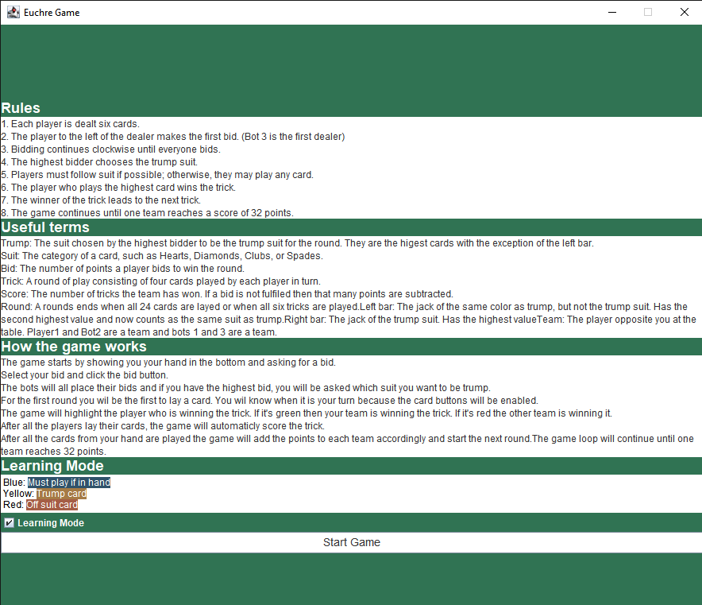
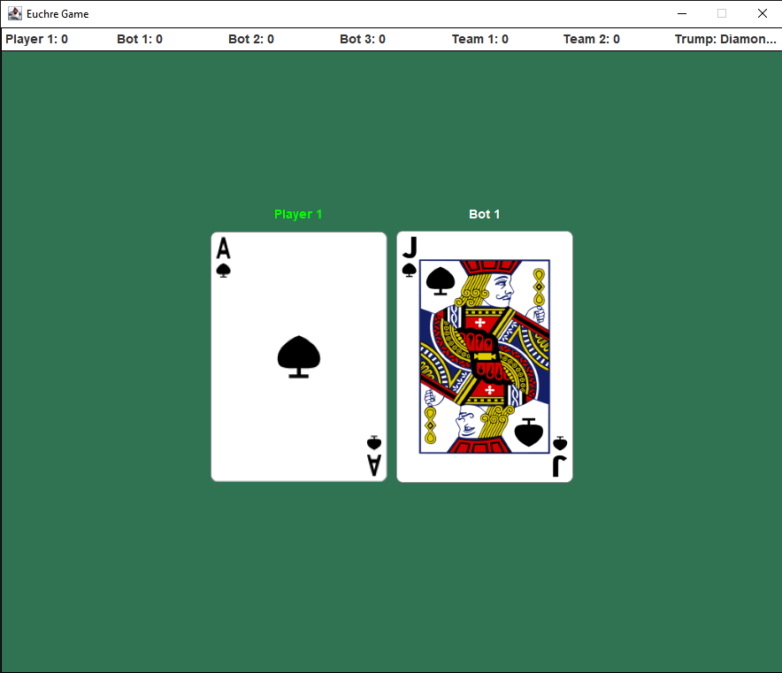

# Euchre Game Rules

This README provides an overview of the rules for playing the popular card game Euchre. The game is played in rounds, and each round has its own set of rules and objectives. There are four players. (One human, and three computer-controlled players)

## Game Start/Rules

## Game Rounds

During the game rounds, players take turns playing their cards. The objective is to win as many tricks a possible.
